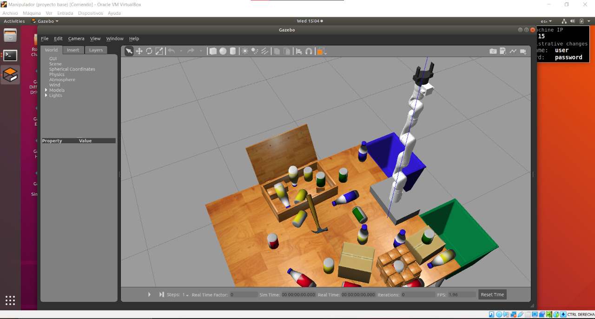

# Robocup virtual manipulator challenge 

## Resources 
*	[Virtual manipulator challenge main page](https://2021.robocup.org/robot-manipulation) 
* [Video introduction](https://youtu.be/h-IVj2tajQQ?t=1561)
* [Robocup@work team qualifications](https://atwork.robocup.org/2021/03/12/robocup-2021-worldwide-call-for-participation/) 
* [Robocup@home team qualifications](https://athome.robocup.org/2021-cfp-all/)
* [Github getting started](https://github.com/mathworks-robotics/templates-robocup-robot-manipulation-challenge)
*	[Design and Control of Robot Manipulators ](https://www.facebook.com/notes/matlab-and-simulink-robotics-arena/design-and-control-of-robot-manipulators-technical-resources/3351011848336733/) 
* [Get started with gazebo](https://www.mathworks.com/help/ros/ug/get-started-with-gazebo-and-a-simulated-turtlebot.html)
* [Blog](https://jsduenass.github.io/posts/matlab/)

### Other resources 
* [Pick-and-Place Workflow in Gazebo Using Point-Cloud Processing and RRT Path Planning](https://www.mathworks.com/help/robotics/ug/pick-and-place-gazebo-with-point-clouds-and-rrt.html)

## Objective
Crate an algorithm for the robotic arm so it can sort properly the cans and bottles. 
* Cans must go into the green bin
* Bottles must go into the blue bin 

## Config of this project
* A submodule is used the repository [vision_](https://github.com/mora200217/vision_) if you want to clone this repository use the command ```git clone --recurse-submodules https://github.com/jsduenass/virtual_manipulator```
* add the folders ```data``` and ```functions``` to the matlab path.
* if you need to change the ROS ip address run the following command so git ignores the changes```git update-index --skip-worktree data/ROS_ip.txt```. If you need to update the submodule ```git submodule update --remote --merge```

